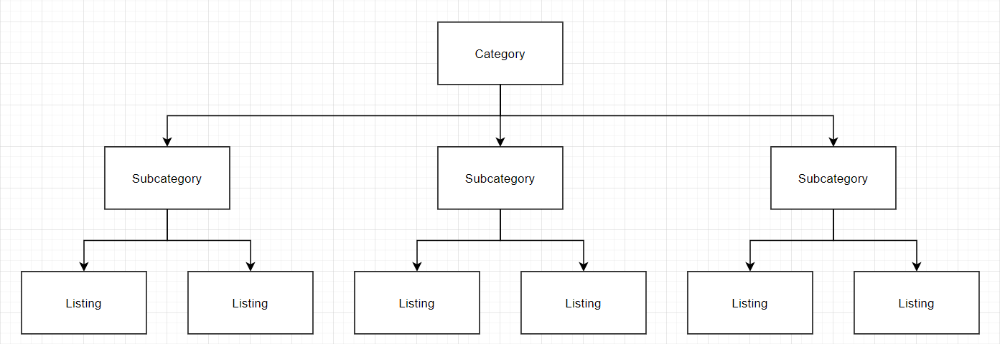

# Database for Auction Website

**Disclamer: This is not a final version, changes may include: structure of a database, contents of tables, and more. Those changes will be made when problems appear in backend development.**

## Table of Contents:

1. **[Disclamer about diagram](#1.-Disclamer-about-diagram)**
2. **[Diagram](#2.-Diagram)**
3. **[Explanation of unclear concepts and solutions](#3.-Explanation-of-unclear-concepts-and-solutions)**
    1. [Categories and subcategories](#3.1-Categories-and-subcategories)
    2. [User and user addresses](#3.2-User-and-user-addresses)
        1. [Redundant data](##3.2.1-Redundant-data)
        2. [Password attribute data type](##3.2.2-Password-attribute-data-type)
        3. [Phone numbers in database](##3.2.3-Phone-numbers-in-database)
        4. [Activated attribute](##3.2.4-Activated-attribute)
        5. [Postal codes in database](##3.2.5-Postal-codes-in-database)
        6. [Way of saving states](##3.2.6-Way-of-saving-states)

# 1. Disclamer about diagram

Diagram is made with draw.io, in case you don't want to use this, here you have a screenshot of this diagram. **Note: It is possible, that a structure of this database has changed, but this file has not. If you want to be 100% sure with having the newest diagram you should use [this diagram](./db-concept.drawio).**

# 2. Diagram

# 3. Explanation of unclear concepts and solutions

Some design concepts might be unclear for people not involved in process of conceptual work. This section explains most of problematic solution contained in the project of a database.

# 3.1 Categories and subcategories

Every listing have asigned subcategory. Because of that listing inherits a category from subcategory. These entites are organised in a hierarchy.

### Below is a diagram explaining connections and hierarchy between listings, categories and subcategories:

# 3.2 User and user addresses

Here are explained concepts used in this database that we think can cause problems without proper knoleadge.

## 3.2.1 Redundant data

It is not hard to think, that in table `Users` is unnecessary data about owner of an account (`owners_name`, `owners_surname` and `owners_phone`). This information can be accessed from saved address in `user_addresses` table. **We did not think, that such data should be saved as an address, since addresses are changed relatively frequent. That is why name, surname and phone of a owner of each account is saved in `Users` table.**

## 3.2.2 Password attribute data type

In `Users` table there is a `password` attribute with data type `BINARY(60)`. Reason for usage of this data type is simple. For hashing we are using [bcrypt](https://en.wikipedia.org/wiki/Bcrypt) and this data type is recommended.

## 3.2.3 Phone numbers in database

Phone numbers need to be saved in format like this `+XXYYYYYYYYY`, where `XX` is a country code and `ZZZZZZZZZ` is a phone number.

## 3.2.4 Activated attribute

For account to work it needs to be activated. That is a security measure preventing bots from creating huge quantities of accounts. Activation is done by verifing an email. Activated accounts have value `TRUE` in `activated` attribute.

## 3.2.5 Postal codes in database

Postal codes are saved without "-" character, so postal codes should look like this: `XXYYY`, not like this: `XX-YYY`.

## 3.2.6 Way of saving states

We were thinking about 2 solutions to this problem:

- Enum datatype
- Extra table containing all states which are accessed by using foreign key

We have chosen the second option, because it does not limit us with number of states possible to add.